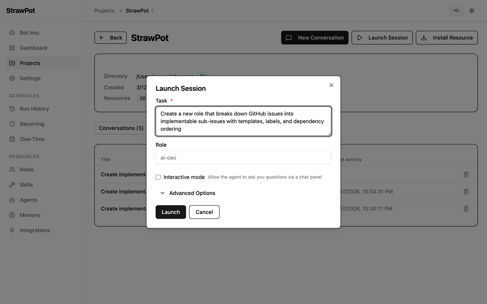

# StrawPot

One engineer. One laptop. One AI company.

An open runtime for role-based AI agents. Agents are defined as roles that orchestrate reusable skills — no Python, no orchestration code, just Markdown files.

<p align="center">
  <a href="https://github.com/strawpot/strawpot/actions/workflows/release.yml"></a>
  <a href="https://discord.gg/2BRsCRUrKb"></a>
  <a href="LICENSE"></a>
</p>

<p align="center">
  
</p>

## Quick Start

```bash
pip install strawpot
strawpot gui
```

## Example Session

```
$ strawpot start "Build a landing page"

[CEO] Analyzing task...
  → Delegating implementation to Engineer
  → Delegating review to Reviewer

[Engineer] Generating HTML and CSS...
  ✓ Created index.html
  ✓ Created styles.css

[QA] Running tests...
  ✓ All checks passed

[Reviewer] Reviewing code...
  ✓ Code approved

You: Approve deployment? (y/n)
```

## Architecture

```
StrawPot (runtime)              StrawHub (ecosystem)
 ├─ Role engine                  ├─ Roles
 ├─ Skill executor               ├─ Skills
 ├─ Memory providers             ├─ Agents
 ├─ Agent adapters               ├─ Integrations
 └─ Web dashboard                └─ Memory providers
```

**StrawPot** is the local runtime that executes agents. **StrawHub** is the registry that distributes reusable roles, skills, and integrations.

## Concepts

- **Roles** — Agent definitions (a Markdown file with instructions and dependencies)
- **Skills** — Reusable capabilities attached to roles (code review, git workflow, etc.)
- **Memory** — Persistent knowledge shared across sessions
- **Integrations** — Chat adapters (Telegram, Slack, Discord)

```yaml
# ai-ceo/ROLE.md
---
name: ai-ceo
description: "Orchestrator that analyzes tasks and delegates to the best-fit role."
metadata:
  strawpot:
    dependencies:
      roles:
        - "*"
    default_agent: strawpot-claude-code
---

You are a routing layer with judgment. The user brings you a task —
you figure out which role on your team should handle it and delegate.
```

One Markdown file defines a role. No Python. No orchestration code.

## How It Works

```
User task → StrawPot → Role (ai-ceo)
                         ├─ Sub-role (implementer)
                         │   ├─ Skills (git-workflow, python-dev)
                         │   └─ Agent (strawpot-claude-code)
                         └─ Sub-role (reviewer)
                             ├─ Skills (code-review, security-baseline)
                             └─ Agent (gemini)
```

When you run `strawpot start`:

1. Creates an isolated environment (worktree or project dir)
2. Starts the Denden gRPC server for agent communication
3. Retrieves memory context from past sessions
4. Launches the orchestrator role (e.g. ai-ceo)
5. Roles delegate tasks to sub-roles automatically
6. Required roles and skills are resolved from StrawHub
7. On exit, records results to memory and cleans up

## Features

- **Define roles in Markdown** — no code required
- **Multi-agent orchestration** — roles delegate to sub-roles automatically
- **Multiple LLM backends** — Claude, Codex, Gemini
- **Persistent memory** — context carries across sessions
- **Chat integrations** — Telegram, Slack, Discord as conversation interfaces
- **Web dashboard** — manage projects, sessions, and schedules from the browser

## Chat Integrations

Connect chat platforms as conversation interfaces. Messages route through
**imu** (StrawPot's self-operation agent) — the same agent that powers the
GUI chat. Adapters are standalone processes managed from the GUI.

```
Telegram / Slack / Discord
        ↓
    Adapter (thin relay)
        ↓
    imu (project_id=0)
        ↓
    delegates to projects/roles
```

Install and manage from the GUI Integrations page, or via CLI:

```bash
strawhub install integration telegram
strawpot gui   # → Integrations page to configure and start
```

Adapters support auto-start, config via env vars, health checks, and
real-time log streaming. Community authors can build and publish adapters
for any platform through StrawHub.

## Ecosystem

| Project | What it does |
|---------|------|
| [**StrawPot**](https://strawpot.com) | Runtime — executes role-based AI agents locally |
| [**StrawHub**](https://strawhub.dev) | Registry — distributes roles, skills, agents, and integrations |
| [**Denden**](https://github.com/strawpot/denden) | Transport — gRPC bridge between agents and the runtime |

Install from StrawHub, run with StrawPot:

```bash
strawpot install role implementer        # from StrawHub registry
strawpot start --role implementer        # runs locally
```

## CLI Usage

```bash
# Start a session
strawpot start
strawpot start --role ai-ceo --runtime strawpot-claude-code

# Install skills, roles, and integrations from StrawHub
strawpot install skill git-workflow
strawpot install role implementer
strawhub install integration telegram

# Search and list
strawpot search "code review"
strawpot list

# Web dashboard
strawpot gui

# Show merged config
strawpot config
```

## Configuration

Global: `$STRAWPOT_HOME/strawpot.toml` (default `~/.strawpot/strawpot.toml`)
Project: `strawpot.toml` (project root)

```toml
runtime = "strawpot-claude-code"       # strawpot-claude-code | strawpot-codex | strawpot-gemini
isolation = "none"                     # none | worktree | docker

[orchestrator]
role = "ai-ceo"

[policy]
max_depth = 3
max_num_delegations = 0       # 0 = unlimited

[memory]
provider = "dial"             # default; "" to disable
```

---

<p align="center">
<strong>StrawPot</strong> — runtime &nbsp;·&nbsp; <strong>StrawHub</strong> — ecosystem &nbsp;·&nbsp; <strong>Denden</strong> — transport
</p>
