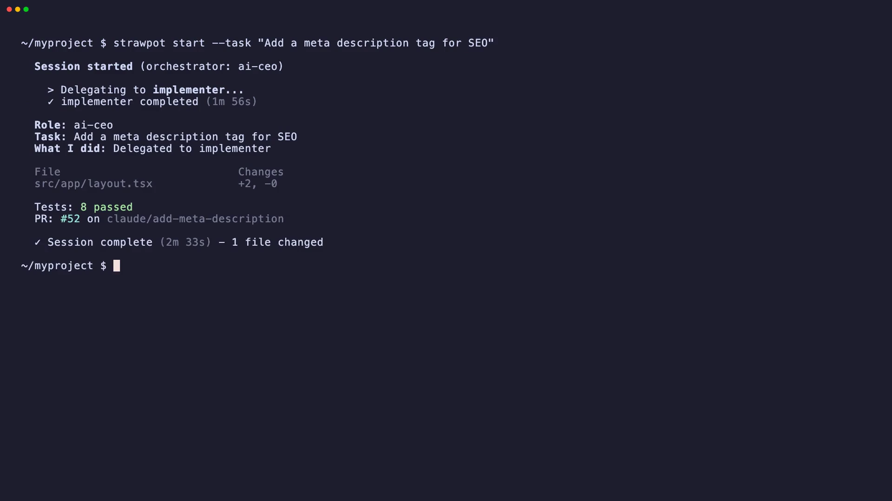

# StrawPot

Role-based orchestration for AI workers.

Run teams of agents locally, resolve skills automatically, and share roles through StrawHub.

<p align="center">
  <a href="https://github.com/strawpot/strawpot/actions/workflows/release.yml"></a>
  <a href="https://discord.gg/6RMpzuKrRd"></a>
  <a href="LICENSE"></a>
</p>

<p align="center">
  
</p>

## Example

Input: "Add dark mode to the app"

Agents may produce structured outputs such as:
- A launch plan with rollout timeline
- A draft announcement post
- Engineering tasks with sub-issues

Outputs are improving but not yet fully reliable.

## Quick Start

```bash
pip install strawpot
strawpot gui
```

## What is StrawPot?

An orchestration system for role-based AI agents.

- **Roles** define what each agent does — CEO plans, engineer builds, reviewer checks
- **Skills** are reusable knowledge modules — git-workflow, code-review, github-issues
- **Agents** execute roles using any runtime — Claude Code, Codex, Gemini
- **Memory** persists context across sessions

Roles and skills are Markdown files. No Python, no orchestration code.

## What this is not

- Not a fully autonomous system — agents need well-defined roles to be effective
- Not production-ready — this is an early preview
- Not a replacement for a team — it's a tool that amplifies what one engineer can do

## Why StrawHub matters

StrawHub is the registry that makes StrawPot an ecosystem, not just a tool.

- **Roles are reusable** — install a role once, use it across projects
- **Skills are composable** — roles pull in the skills they need automatically
- **Behaviors can be shared** — what works for one team benefits everyone
- **The ecosystem grows** through shared role definitions and community iteration

Without shared roles, you're writing prompts from scratch every time. StrawHub is the compounding mechanism.

[strawhub.dev](https://strawhub.dev)

## Architecture

```
StrawPot (runtime)              StrawHub (ecosystem)
 ├─ Role engine                  ├─ Roles
 ├─ Skill executor               ├─ Skills
 ├─ Memory providers             ├─ Agents
 ├─ Agent adapters               ├─ Integrations
 └─ Web dashboard                └─ Memory providers
```

```
User task → StrawPot → Role (ai-ceo)
                         ├─ Sub-role (implementer)
                         │   ├─ Skills (git-workflow, python-dev)
                         │   └─ Agent (strawpot-claude-code)
                         └─ Sub-role (reviewer)
                             ├─ Skills (code-review, security-baseline)
                             └─ Agent (gemini)
```

## Status

Early preview. The orchestration works. The GUI is functional. Outputs are improving through iteration and community contributions.

What works well:
- Multi-agent delegation and coordination
- Session management with traces and artifacts
- Role and skill installation from StrawHub
- Chat interface (Bot Imu) across Slack, Discord, Telegram

What's still evolving:
- Output consistency across different tasks
- Complex multi-step workflows
- Role behavior refinement

## Contributing

Looking for:
- New roles and skills
- Improved agent behaviors
- Real workflow examples
- Bug reports and feedback

This project is designed to be extended. See [CONTRIBUTING.md](CONTRIBUTING.md).

## Community

- [Discord](https://discord.gg/6RMpzuKrRd) — questions, feedback, and discussion
- [GitHub Issues](https://github.com/strawpot/strawpot/issues) — bug reports and feature requests

## License

[MIT](LICENSE)

---

<p align="center">
<em>Open system for role-based AI agents.</em><br/>
<strong>StrawPot</strong> — runtime &nbsp;·&nbsp; <strong>StrawHub</strong> — ecosystem &nbsp;·&nbsp; <strong>Denden</strong> — transport
</p>
