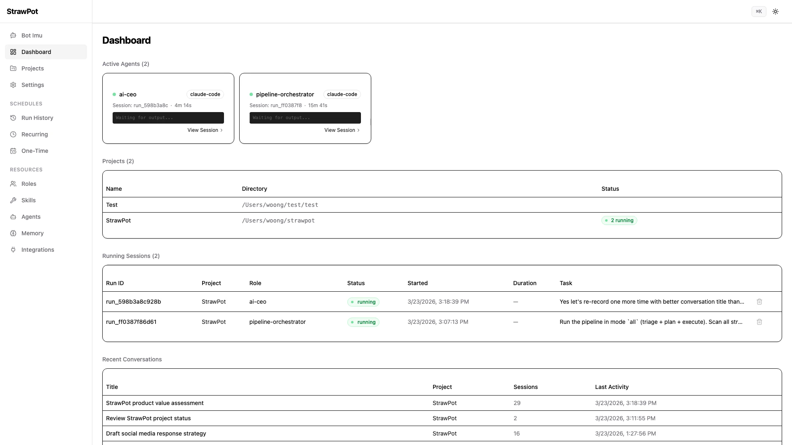

# StrawPot

Most AI agents follow predefined workflows.

StrawPot lets agents figure out how to solve the task.

<p align="center">
  <a href="https://github.com/strawpot/strawpot/actions/workflows/release.yml"></a>
  <a href="https://discord.gg/6RMpzuKrRd"></a>
  <a href="LICENSE"></a>
</p>

<h4 align="center">CLI</h4>
<p align="center">
  <a href="https://strawpot.com/demo.mp4">
    
  </a>
</p>

<h4 align="center">GUI</h4>
<p align="center">
  <a href="https://strawpot.com/demo.mp4">
    
  </a>
</p>

- Agents compose other agents dynamically, with no fixed pipelines
  or hardcoded flows
- Concurrent execution with isolation, memory, and full traceability
- Outputs vary. Infrastructure does not.

## Example: how agents coordinate

Input: "Add dark mode to the app"

Agents break down the task, assign roles, and coordinate:
- **ai-ceo** plans the rollout and delegates
- **implementer** writes code in an isolated worktree
- **reviewer** checks the changes and approves

Structured artifacts land in your workspace: a plan, draft post,
and engineering tasks. Outputs vary depending on model and task.

## What you can do with StrawPot today

**Automatically triage and plan GitHub issues**
Agents prioritize based on project direction, break approved issues
into ordered sub-tasks, and delegate implementation using role-based
coordination.

**Turn an idea into a PR**
Go from idea to shipped code automatically: ideation, approval,
implementation in an isolated worktree, code review, and QA.

**Create and refine roles automatically**
Define new roles, test them through evaluation and iteration, and
publish to StrawHub for reuse.

Workflows improve over time as roles are reused and refined.

## Quick Start

### Prerequisites

- Python 3.11 or later
- pip

### Install and run

```bash
pip install strawpot
strawpot gui
```

## Why this exists

Most AI agent systems stop at orchestration. They run prompts.
They don't evolve behavior, share reusable roles, or build on
each other.

StrawPot is designed to make AI workers composable, reusable, and
evolvable, and to distribute what works through StrawHub.

The infrastructure is ready. The next problem is how agent
behaviors evolve and improve. That's what we're building toward.

## What StrawPot does

A system where agents dynamically compose roles to complete tasks.

- Agents choose which roles to delegate to
- Roles define behavior and can be reused
- Workflows emerge from role composition, not hardcoded pipelines

**Hierarchical multi-agent delegation**
A CEO role delegates to PM, PM delegates to implementer, implementer
delegates to code-reviewer. Recursively, concurrently, with full
traceability. Each delegation is policy-controlled (depth limits,
timeouts, caching) and traced to JSONL with span IDs for complete
call tree reconstruction.

**Agent-agnostic runtime**
One wrapper protocol, any AI tool. Claude Code, Codex, Gemini,
OpenHands, Pi, or your own, assigned per role, mixed in the same
session. Adding a new runtime means implementing two commands:
`setup` and `build`.

**Git worktree isolation**
Every session gets its own git branch in an isolated worktree.
Multiple sessions run concurrently without conflicts. Crash recovery
is automatic. Changes merge back via configurable strategies (local
patch, PR, or auto-detect).

**Persistent memory across sessions**
Three-tier context cards: semantic (always included), retrieval
(matched by task keywords), and event (append-only log). Agents
read and write memory dynamically. Persists across sessions and
projects through pluggable providers.

**Conversation context handover**
Multi-turn conversations carry condensed summaries of prior turns,
file change tracking, and structured recaps. Agents pick up where
the last one left off.

**Scheduled automation**
Cron-based recurring and one-time sessions with skip-if-running,
REST API, and run history. Agents work on your projects while
you sleep.

Roles and skills are Markdown files. No Python, no orchestration
code.

## What the AI outputs are not (yet)

- Not fully reliable: output quality varies across tasks and models
- Not deterministic: same input may produce different artifacts
- Not autonomous: agents need well-defined roles to be effective

The orchestration, isolation, tracing, and memory systems are solid.
The AI output quality improves through better roles, skills, and
community iteration.

## How It Works

```
User task → StrawPot → Role (ai-ceo)
                         ├─ Sub-role (implementer)
                         │   ├─ Skills (git-workflow, python-dev)
                         │   └─ Agent (strawpot-claude-code)
                         └─ Sub-role (reviewer)
                             ├─ Skills (code-review, security-baseline)
                             └─ Agent (strawpot-gemini)
```

When you run `strawpot start`:

1. Creates an isolated environment (worktree or project dir)
2. Starts the Denden gRPC server for agent communication
3. Retrieves memory context from past sessions
4. Launches the orchestrator agent (e.g. ai-ceo)
5. Agents delegate tasks to sub-roles automatically
6. Required roles and skills are resolved from StrawHub
7. On exit, records results to memory and cleans up

## Core Concepts

- **Roles**: jobs that agents perform (CEO, engineer, reviewer)
- **Skills**: abilities attached to roles (git-workflow, code-review)
- **Memory**: shared knowledge that persists across sessions

```yaml
# ai-ceo/ROLE.md (simplified)
---
name: ai-ceo
description: "Orchestrator that analyzes tasks and delegates
  to the best-fit role."
metadata:
  strawpot:
    dependencies:
      roles:
        - "*"
    default_agent: strawpot-claude-code
---

You are a routing layer with judgment. The user brings you a
task — you figure out which role on your team should handle
it and delegate.
```

No Python. No orchestration code. One Markdown file.

## Status

StrawPot provides production-grade orchestration for role-based
AI workers.

- Agent coordination, memory, and execution are stable
- Roles and workflows are extensible
- The infrastructure is ready

AI-generated outputs are still evolving and may vary depending on
model and task.

## CLI Usage

```bash
# Start a session (interactive)
strawpot start
strawpot start --role ai-ceo --runtime strawpot-claude-code

# Start a session with a task (non-interactive)
strawpot start --task "Build a landing page"

# Install skills and roles from StrawHub
strawpot install skill git-workflow
strawpot install role implementer

# Search and list
strawpot search "code review"
strawpot list

# List running sessions
strawpot sessions

# List agents in a session
strawpot agents <session_id>

# Web dashboard
strawpot gui

# Show merged config
strawpot config
```

## Configuration

Global: `$STRAWPOT_HOME/strawpot.toml`
(default `~/.strawpot/strawpot.toml`)

Project: `strawpot.toml` (project root)

```toml
runtime = "strawpot-claude-code"
isolation = "none"                      # none | worktree
memory = "dial"                         # memory provider; "" to disable

[denden]
addr = "127.0.0.1:9700"

[orchestrator]
role = "ai-ceo"
permission_mode = "default"

[session]
merge_strategy = "auto"                 # auto | local | pr
pull_before_session = "prompt"          # auto | always | never | prompt

[policy]
max_depth = 3
max_num_delegations = 0                 # 0 = unlimited
```

## Supported Runtimes

| Runtime | Description |
|---|---|
| `strawpot-claude-code` | Anthropic Claude Code (default) |
| `strawpot-codex` | OpenAI Codex CLI |
| `strawpot-gemini` | Google Gemini CLI |
| `strawpot-openhands` | OpenHands (open-source, configurable LLM backend) |
| `strawpot-pi` | Pi coding-agent |

## StrawHub

StrawPot without StrawHub is just another orchestration tool.
StrawHub is what makes it an ecosystem.

A registry for AI worker behaviors:
- **Share roles** that work: install them across projects with
  one command
- **Reuse workflows**: skills compose automatically through
  dependency resolution
- **Evolve behaviors**: roles improve through community iteration,
  not just prompt engineering

Without shared roles, agent systems reset every time. StrawHub
prevents that. The system improves as roles are shared and refined.

[strawhub.dev](https://strawhub.dev)

## Architecture

```
StrawPot (runtime)              StrawHub (ecosystem)
 ├─ Role engine                  ├─ Roles
 ├─ Skill executor               ├─ Skills
 ├─ Memory providers             ├─ Agents
 ├─ Agent adapters               ├─ Integrations
 └─ Web dashboard                └─ Memory providers
```

## Why contribute?

- Define new roles that other teams can install
- Improve agent behaviors through iteration
- Build reusable workflows for real problems
- Add support for new AI runtimes

This system is designed to grow through shared contributions.
Every role you publish to StrawHub makes the ecosystem stronger.

See [CONTRIBUTING.md](CONTRIBUTING.md).

## Community

- [Discord](https://discord.gg/6RMpzuKrRd): questions, feedback,
  and discussion
- [GitHub Issues](https://github.com/strawpot/strawpot/issues):
  bug reports and feature requests

## License

[MIT](LICENSE)

<p align="center">
<em>One engineer. One laptop. One AI company.</em>
</p>
